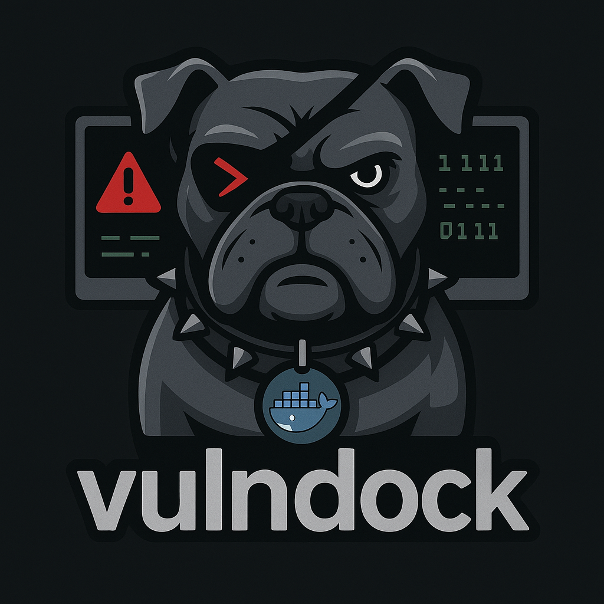
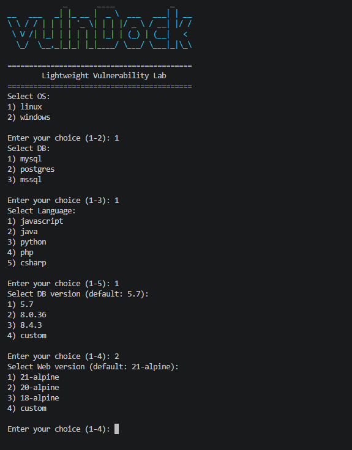

# VulnDock



VulnDock is a lightweight vulnerability lab setup tool designed for penetration testing and security training. It allows users to quickly deploy vulnerable web environments in Docker containers with various combinations of operating systems, databases, and programming languages.

## Features

- **Multiple Language Support**: Deploy vulnerable applications in JavaScript (Node.js), Java, Python, PHP, and C# (ASP.NET)
- **Database Options**: Choose from MySQL, PostgreSQL, or MSSQL databases
- **OS Compatibility**: Supports both Linux and Windows-based containers
- **Pre-built Vulnerable Apps**: Includes sample vulnerable web applications for each supported language
- **Docker Integration**: Easy deployment using Docker and Docker Compose
- **CTF Challenges**: Includes CTF1 challenge with Apache and Node.js setup

## Installation

### Prerequisites

- Docker and Docker Compose installed on your system
- PowerShell (for Windows users)

### Clone the Repository

```bash
git clone https://github.com/yourusername/vulnDock.git
cd vulnDock
```

## Usage

### Using the PowerShell Script

Run the `vulnDock.ps1` script to interactively set up your vulnerable environment:

```powershell
.\vulnDock.ps1
```

The script will prompt you to select:
- Operating System (Linux/Windows)
- Database (MySQL/PostgreSQL/MSSQL)
- Programming Language (JavaScript/Java/Python/PHP/C#)

### Principal Menu

The principal menu of the tool is displayed when running the `vulnDock.ps1` script. It provides an interactive interface for users to select the operating system, database, and programming language to configure their vulnerable environment.



### Using Docker Compose

For pre-configured setups:

# CTF1 Challenge
cd CTF1
docker-compose up
```

### Accessing the Applications

Once deployed, access the web applications at:
- Main Web App: http://localhost:80
- CTF1 Challenge: http://localhost:80 (web) and http://localhost:8080 (db-apache)

## Project Structure

```text
vulnDock/
├── ASPNETWebapp/          # ASP.NET Core vulnerable web app
├── CTF1/                  # CTF challenge with Node.js and Apache
├── database/              # Database setup scripts
│   ├── mssql/
│   ├── mysql/
│   └── postgres/
├── Docker/                # Dockerfiles for different setups
├── Frontend/              # Static frontend files
├── JavaWebapp/            # Java Spring Boot vulnerable app
├── NodeJSWebapp/          # Node.js Express vulnerable app
├── PHPWebapp/             # PHP vulnerable web app
├── PythonWebApp/          # Python Flask vulnerable app
├── Test files/            # Sample test data
├── Webshells/             # Web shell samples
├── docker-compose.yml     # Main compose file
├── vulnDock.ps1           # PowerShell setup script
└── README.md
```

## Contributing

Contributions are welcome! Please feel free to submit a Pull Request.


## Author

Adrian Guzman
